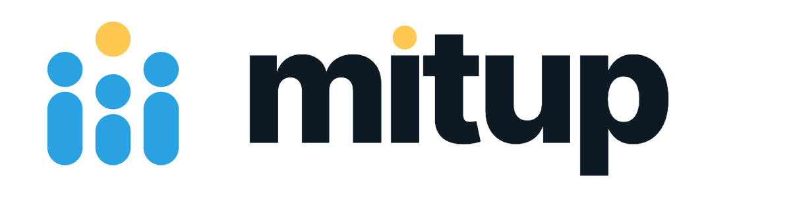

  

A Telegram bot that brings people together. Mitup lives in a private DM with you, never in your group chat. Create a meeting, share one message, and let Mitup handle RSVPs, reminders, and timezones for you.

[Open @mitupbot on Telegram →](https://t.me/mitupbot)

## Documentation

The full docs live at [mitup.social](https://mitup.social): user guides, configuration, FAQ, and contributor setup.

## Contribute

Mitup is MIT-licensed and built by a small group of people. A few ways in:

* **[Code contributor guide](https://mitup.social/collaborate/code_contributor/)**: set up the dev environment, pick a good-first-issue, send a patch.
* **[Translator guide](https://mitup.social/collaborate/translator/)**: help bring Mitup to your language on Crowdin. No code needed.
* **[Become a supporter](https://mitup.social/collaborate/supporter/)**: back the bot monthly on Patreon.
* **[Code of conduct](https://mitup.social/collaborate/code_of_conduct/)**: read this before opening issues or merge requests.

## Help

* Usage questions: check the [docs](https://mitup.social) first.
* Bugs and feature requests: [open an issue](https://gitlab.com/meetupbot/mitup-telegram-bot/-/issues) using the right template.
* Anything else: tap the *Help* button inside the bot, or email [the service desk](mailto:contact-project+meetupbot-mitup-telegram-bot-50258547-issue-@incoming.gitlab.com).

## License

Mitup is licensed under the [MIT License](LICENSE).
