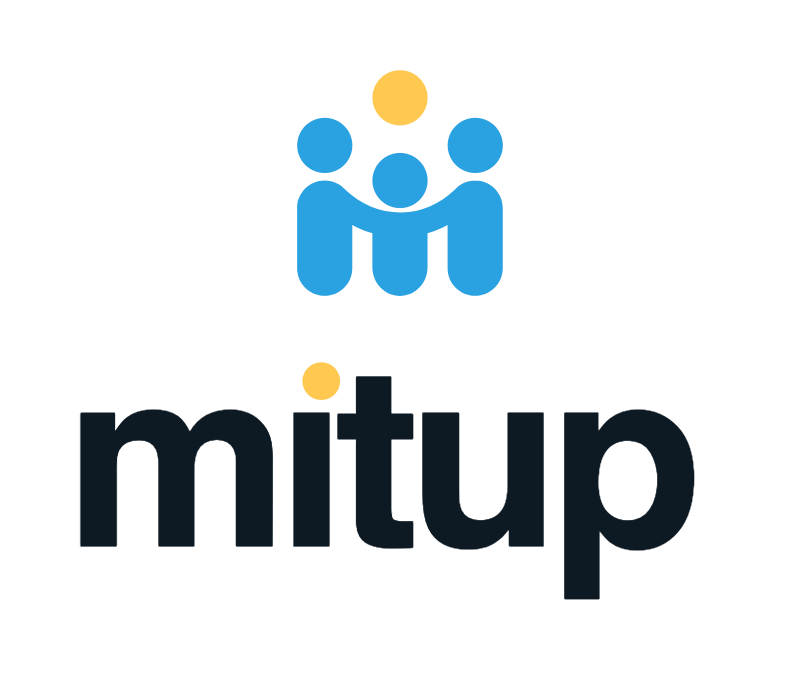

  
  

    
  

A Telegram bot that brings people together. Mitup lives in a private DM with you, never in your group chat. Create a meeting, share one message, and let Mitup handle RSVPs, reminders, and timezones for you.

[Open @mitupbot on Telegram →](https://t.me/mitupbot?start=src_web)

## What it does

* **Lives in your DMs.** No bot joins your group, no trackers, no ads. You share a card; the group chat stays a group chat.
* **Configurable meetings.** Per-meeting toggles for a waiting list, public sharing, open invitations, and more.
* **Reminders in your timezone.** A reminder before the start, in each person's own timezone. Choose how far ahead, or turn it off.
* **Speaks six languages.** English, Spanish, German, Galician, Brazilian Portuguese, and Italian, translated by the community.

## Documentation

The full docs live at [mitup.social](https://mitup.social): user guides, FAQ, and the contributor handbook.

## Contribute

Mitup is MIT-licensed and built by a small group of people. A few ways in:

* **[Developer handbook](https://mitup.social/collaborate/code_contributor/):** set up the dev environment, pick a good-first-issue, send a patch.
* **[Translator guide](https://mitup.social/collaborate/translator/):** help bring Mitup to your language on Crowdin. No code needed.
* **[Support Mitup](https://mitup.social/collaborate/donation/):** back the bot monthly on Patreon to keep it online.
* **[Code of conduct](https://mitup.social/collaborate/code_of_conduct/):** read this before opening issues or merge requests.

See [CONTRIBUTING.md](CONTRIBUTING.md) for the short version.

## Help

* Usage questions: check the [docs](https://mitup.social) first, or tap *Help* inside the bot.
* Bugs and feature requests: [open an issue](https://gitlab.com/meetupbot/mitup-telegram-bot/-/issues) using the right template.
* Everything else: email [support@mitup.social](mailto:support@mitup.social). You can also reach the GitLab [service desk](mailto:contact-project+meetupbot-mitup-telegram-bot-50258547-issue-@incoming.gitlab.com), which files your message as a tracked issue.

## License

Mitup is licensed under the [MIT License](LICENSE).
