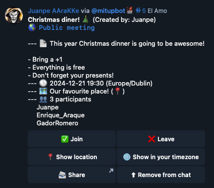

---
hide:
    - navigation
---

# Mitup Telegram Bot

{align=leftr width=60%}

We know how hard it can be to organize anything with friends in a Telegram group with over 20-50 people. We have seen it all:

??? quote ":eye: **The Déjà vu**"
    _If you are comming copy the message and add your name to the list!_

??? quote ":fontawesome-brands-meta:{.lg} **The group**"
    _Hey guys! We have created this group for the event, please join!_

??? quote ":detective: **The private event**"
    _For those of you that want to join the event, send me a private message so I can count you in_

Mitup Telegram Bot was born out of necessity when, back in 2014, we found how hard it was to organize an online game in a group with 120 people. Since then, tenths of thousands of users have used it to organize all kind of events with their friends in Telegram.

[:fontawesome-solid-paper-plane: Start with MitupBot now!](https://t.me/mitupbot){ .md-button .md-button--primary }
{.center}

## Easy to use

With [@mitupbot] there is no need to add the bot to your groups and annoy every one in it while the people going to the event interact with it.

* :lock: Interact with the bot in your own chat
* :pen: Create a meeting a configure it the way you want it
* :envelope: Share the meeting as a normal message to your group
* :check_mark: Keep track of the people that have joined

<figure markdown="span">
  { width="300" }
  <figcaption>That's it!</figcaption>
</figure>

## Configurable

You can configure:

* :globe_with_meridians: **Language**

    ---
    Translated by the community!

* :bell: **Notifications**

    ---
    Be notified when the event is about to start

* :one_thirty: **Timezone**

    ---
    So you can share events even if you are traveling to the other side of the world

* :sparkles: **Custom events**

    ---
    Events can be customized with many options to suit your needs

