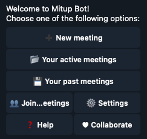

# The Main Menu

Once you are registered you will be welcomed to the Main Menu. This is Mitup's main hub and from here you will be able to access everything you can do within the bot.

<figure class="center" markdown="span">

{loading=lazy}
<figcaption>Mitup Main Menu</figcaption>

</figure>

The buttons on the main menu represent the full set of actions that you can do within Mitup. There are no commands to take any actions other than the `/main_menu` command, which takes you to this menu.

The different available actions are:

* *:heavy_plus_sign: New meeting*{.button-like}: From here, you can create a new meeting, configure it and share it once finished. See [Creating a meeting](create_meeting.md).
* *:open_file_folder: Your active meetings*{.button-like}: here you can find every active meeting you have created. A meeting becomes inactive after a given amount of time after the meeting has happened.
* *:floppy_disk: Your past meetings*{.button-like}: contains a list of every inactive meeting that has not yet been deleted.
* *:busts_in_silhouette: Joined meetings*{.button-like}: these are meetings you have joined but do not own. This is helpful if you want to access an upcoming meeting but can't find where it was sent. Since you do not own these meetings, editing options are unavailable for these meetings.
* *:gear: Settings*{.button-like}: This is where you can configure Mitup. See [Mitup Configuration](configuration.md).
* *:question: Help*{.button-like}: here you can find useful links within the bot and access support. We do our best to answer your questions in a timely manner.
* *:heart: Collaborate*{.button-like}: Mitup does not monetize the bot with ads to avoid turning into a nuisance for its users. However, if you want to support the effort, help build Mitup or help with the operational costs of keeping this bot running, here you will find ways you can help. See the [Collaborate](../collaborate/supporter.md) page.

!!! info "Meeting lifecycle"

    Once a meeting is created, Mitup tracks its existence until it is deleted either by the owner or automatically. To better understand when a meeting transitions from active to inactive or when it is permanently deleted, see [Meeting lifecycle](meeting_lifecycle.md).
